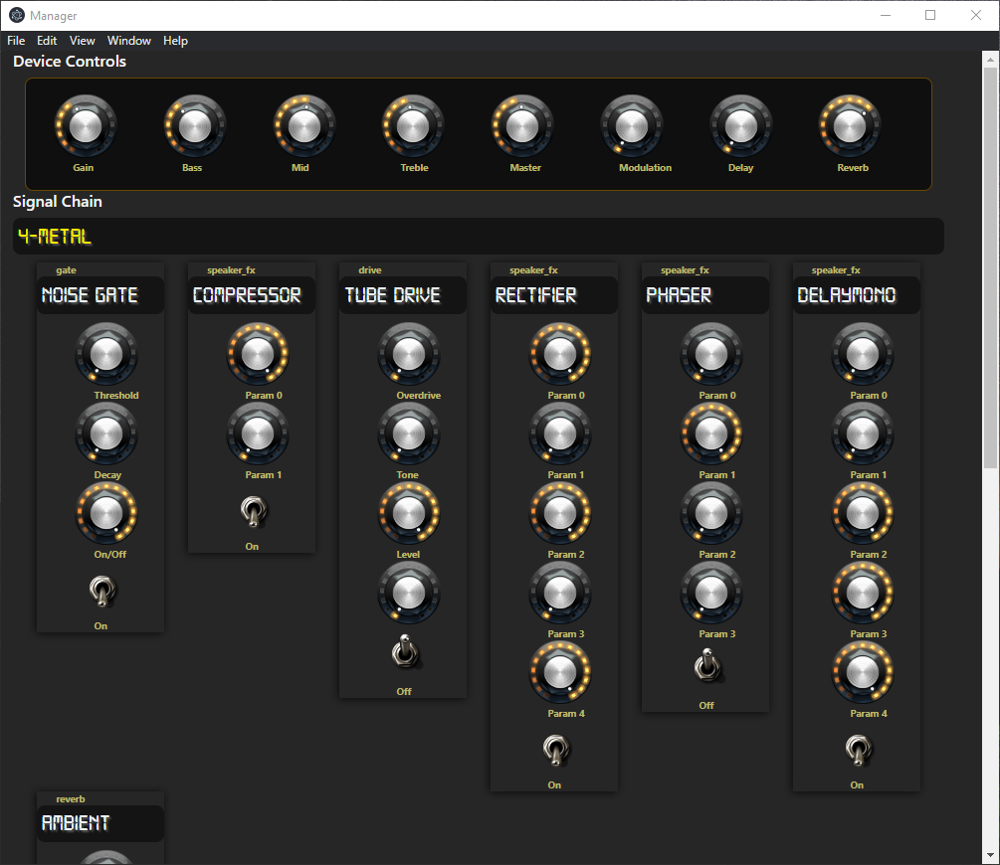

# Tone Manager UI

UI to connect to amp via bluetooth, manage basic settings and set presets.

## Build

rebuild npm packages for electron version of node: `.\node_modules\.bin\electron-rebuild.cmd`

force rebuild with `.\node_modules\.bin\electron-rebuild.cmd -w bluetooth-serial-port -f`
re-link custom version of bluetooth serial port: `npm link bluetooth-serial-port`

template is loosely based on https://www.sitepen.com/blog/getting-started-with-electron-typescript-react-and-webpack